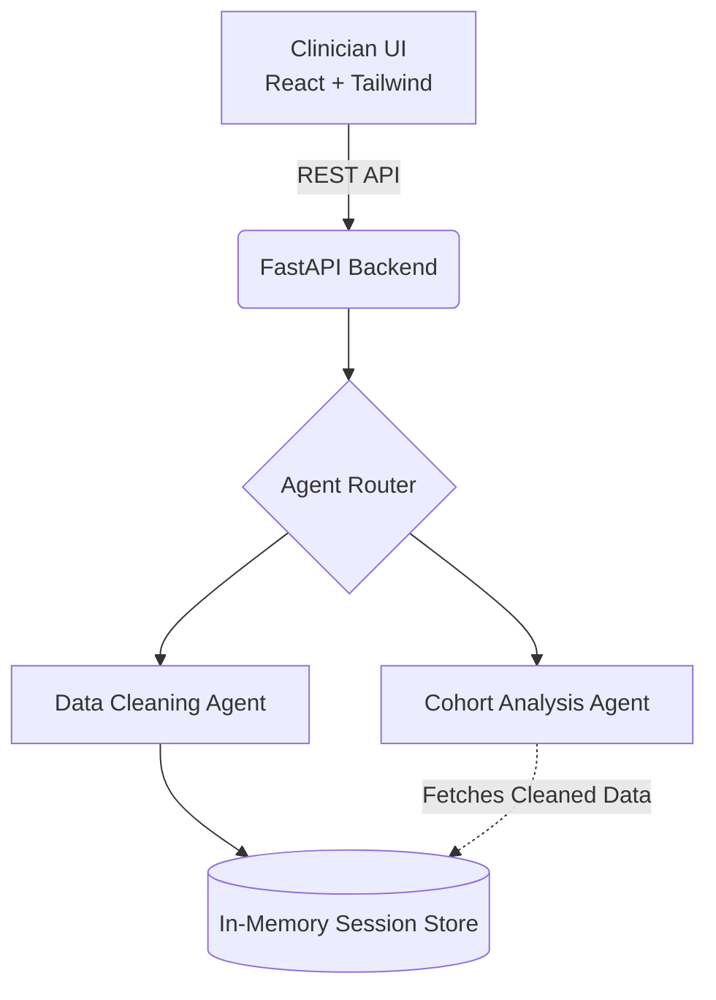
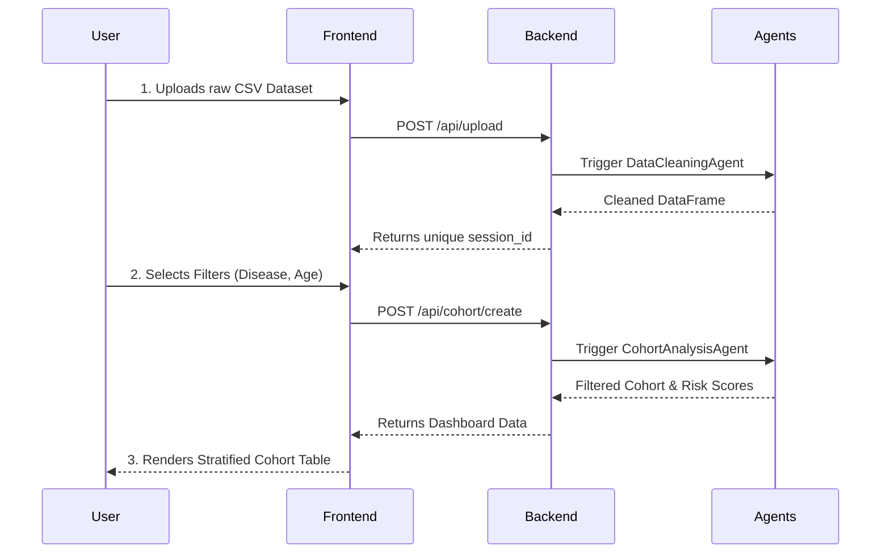

# Mid-Term Presentation: Clinical Cohort AI System

Here is a comprehensive slide-by-slide outline for your mid-term presentation. Since this is the mid-term evaluation, the focus is heavily on the **foundational architecture**, the **Data Cleaning Agent**, and the **Cohort Analysis Agent**, while leaving the generative LLM features as future work for the end-term.

---

## Slide 1: Title Slide
- **Title**: Clinical Cohort AI System
- **Subtitle**: Mid-Term Progress Presentation (Sessional 2)
- **Presenter**: [Your Name]
- **Program**: MTech Data Science

---

## Slide 2: The Problem Statement
- **The Bottleneck**: Patient recruitment is the most time-consuming phase of clinical research.
- **The Statistic**: Nearly 80% of clinical trials fail to recruit their required patient cohorts within the allotted timeframe.
- **The Challenge**: Manually reviewing and screening thousands of messy, unstructured Electronic Health Records (EHRs) is highly prone to human error and cognitive fatigue.

---

## Slide 3: Project Objectives
- **End Goal**: To build a Full-Stack Agentic AI platform that automates the clinical data analysis lifecycle.
- **Key Objectives**:
  1. Automate data ingestion and missing value imputation.
  2. Dynamically filter and generate precise patient cohorts.
  3. Perform deterministic clinical risk stratification.
  4. *(Future Work)* Integrate Large Language Models (LLMs) for natural language querying.

---

## Slide 4: Mid-Term Progress Summary
*What we have achieved so far (Half-way mark):*
- Designed and deployed the decoupled **Client-Server Architecture**.
- Built the **React & TailwindCSS** frontend dashboard.
- Built the **FastAPI** backend orchestrator with an in-memory session store.
- Developed the **Data Cleaning Agent** (Statistical Imputation).
- Developed the **Cohort Analysis Agent** (Filtering & Risk Scoring).

---

## Slide 5: System Architecture
- **Frontend**: React (TypeScript) + Vite
  - Provides a clean UI for clinicians to upload CSV datasets and select clinical filters.
- **Backend**: FastAPI (Python)
  - Highly performant RESTful API server.
  - Manages session IDs to temporarily persist uploaded data in RAM without requiring an external database setup during this phase.

---

## Slide 6: The Data Cleaning Agent
*Clinical data is inherently noisy. How do we handle it?*
- **Mechanism**: Autonomous Statistical Imputation.
- **Continuous Numerical Data**: 
  - e.g., Blood Pressure, Age, BMI.
  - Replaced using the **Median** to ensure robustness against extreme biological outliers.
- **Categorical Data**:
  - e.g., Gender, Diagnosis.
  - Replaced using the **Mode** (the most frequently occurring class).

---

## Slide 7: The Cohort Analysis Agent
*How do we identify eligible patients?*
- **Structured Filtering**: Applies optimized Pandas Boolean masking to instantly slice massive datasets based on user-selected criteria (disease, medication).
- **Deterministic Risk Stratification**: 
  - Evaluates combinations of physiological markers (e.g., BMI > 30 AND Blood Sugar > 140).
  - Assigns a definitive risk tier: Critical, High, Moderate, or Low.
  - *Why Deterministic?* Ensures 100% mathematical accuracy without the hallucination risks associated with AI.

---

## Slide 8: The Clinical Workflow (Demo / Walkthrough)
*Walk the evaluators through the steps completed so far:*

1. **Upload**: Clinician uploads a raw clinical CSV file.
2. **Clean**: Backend intercepts, cleans data, and returns a unique `session_id`.
3. **Initialize**: Dashboard dynamically populates dropdown menus with available diseases and medications found in the specific dataset.
4. **Generate**: Clinician selects filters, and the system instantly returns a stratified cohort with summary statistics.

---

## Slide 9: Roadblocks Overcome
- **Imbalanced Data**: Dealt with missing fields through rigorous statistical imputation rather than dropping rows, preserving valuable patient records.
- **State Management**: Implemented backend session storage so users don't have to re-upload massive CSV files for every new query.

---

## Slide 10: Future Scope (For End-Term)
*What comes next in Sessional 3 / End-Term?*
- **Generative AI Integration**: Connecting the pipeline to OpenAI's GPT-4o-mini.
- **Insight Agent**: Generating executive medical summaries based on the cohort data.
- **Protocol Agent**: Using AI to detect deviations from standard medical guidelines.
- **Interactive Chat Box**: A natural language QA system for clinicians to "chat" directly with their datasets.

---

